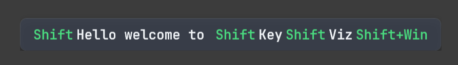
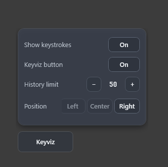
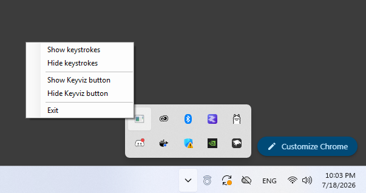

# KeyViz (Key Visualizer)

### Show keystrokes



### Keyviz settings



### System tray



## ติดตั้งและรัน

รองรับ Windows 10/11 และต้องติดตั้ง [.NET 10 SDK](https://dotnet.microsoft.com/download/dotnet/10.0)

```bash
# รันโปรแกรม

dotnet restore
dotnet build
dotnet run

# คลิกขวาที่ไอคอน System Tray เพื่อแสดง/ซ่อน keystrokes,
# แสดง/ซ่อนปุ่ม Keyviz หรือปิดโปรแกรม

# Publish เป็นไฟล์เดียวสำหรับนำไปใช้เครื่องอื่น

dotnet publish -c Release -r win-x64 --self-contained true -p:PublishSingleFile=true

# ไฟล์ที่ publish แล้ว

bin\Release\net10.0-windows\win-x64\publish\KeyViz.exe

# นำ KeyViz.exe ไปเปิดบน Windows 10/11 ได้โดยไม่ต้องติดตั้ง .NET เพิ่ม
```

---

## Install and run

KeyViz supports Windows 10/11 and requires the [.NET 10 SDK](https://dotnet.microsoft.com/download/dotnet/10.0).

```bash
# Run the application

dotnet restore
dotnet build
dotnet run

# Right-click the System Tray icon to show or hide keystrokes,
# show or hide the Keyviz button, or exit the application.

# Publish a single file for another machine

dotnet publish -c Release -r win-x64 --self-contained true -p:PublishSingleFile=true

# Published file

bin\Release\net10.0-windows\win-x64\publish\KeyViz.exe

# Run KeyViz.exe on Windows 10/11 without installing .NET.
```
